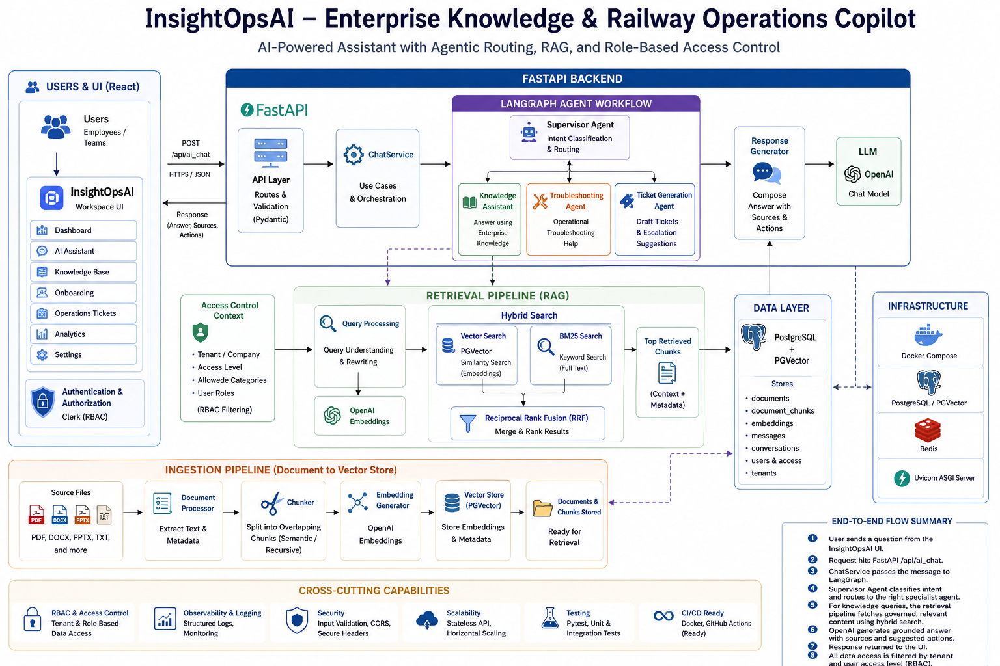
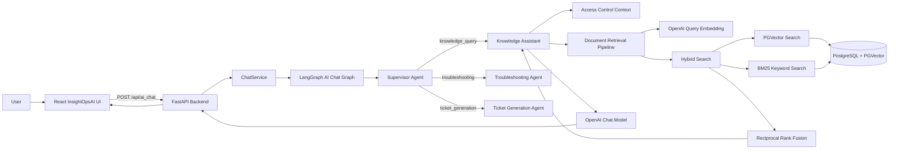
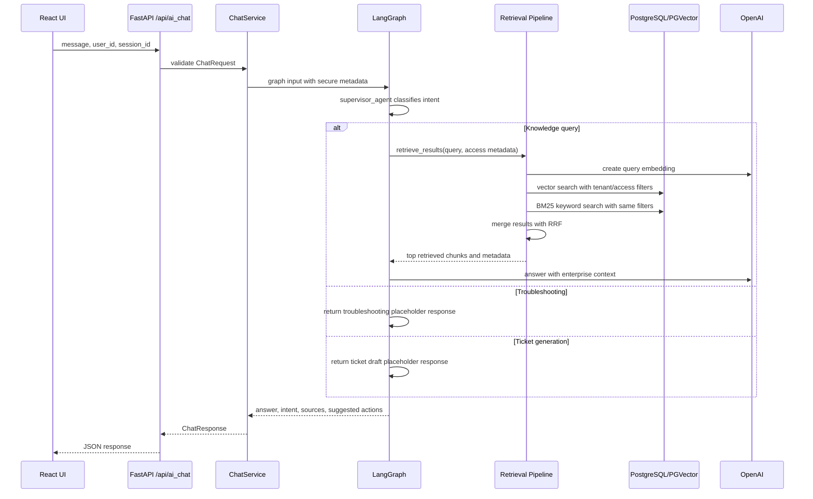
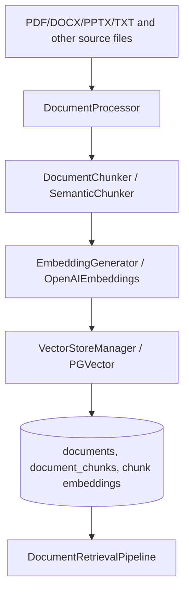
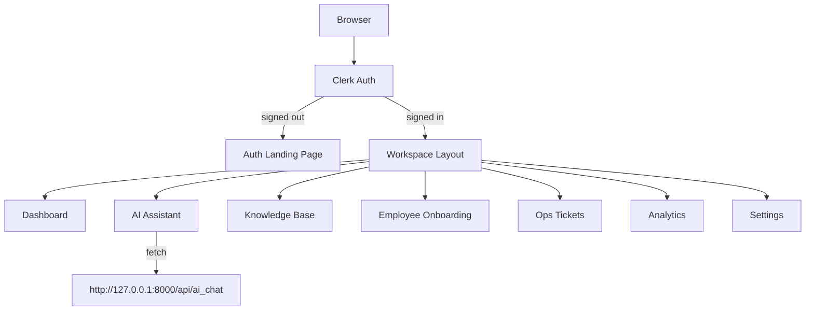

# InsightOpsAI
** Enterprise knowledge and operations copilot**

[](https://www.python.org/)
[](https://fastapi.tiangolo.com/)
[](https://www.langchain.com/)
[](https://www.langchain.com/langgraph)
[](https://github.com/pgvector/pgvector)
[](https://redis.io/)
[](https://react.dev/)
[](https://vitejs.dev/)

InsightOpsAI is an enterprise knowledge and railway-operations copilot. The
backend exposes a FastAPI service that classifies user intent, routes requests
through a LangGraph agent workflow, retrieves governed knowledge from a
PostgreSQL/PGVector RAG store, and generates grounded answers with OpenAI. The
React UI provides the workspace experience for AI assistance, knowledge search,
onboarding, operations tickets, analytics, and settings.

The project is designed for interview discussion around RAG architecture,
agentic routing, RBAC-aware retrieval, full-stack integration, and operational
AI use cases.


## High-Level Architecture



## Key Capabilities

- Intent-routed AI assistant using LangGraph supervisor and specialist agents.
- Knowledge assistant with hybrid retrieval: vector search + BM25 + reciprocal
  rank fusion.
- Tenant and access-level filtering before retrieval.
- PostgreSQL + PGVector schema for documents, chunks, embeddings, messages, and
  conversations.
- Document-processing, chunking, embedding, and vector-store modules for RAG
  ingestion.
- React/Vite UI protected by Clerk authentication.
- Workspace modules for dashboard, AI assistant, knowledge base, onboarding,
  operations tickets, analytics, and settings.

## Tech Stack

| Layer | Technology |
| --- | --- |
| Backend API | FastAPI, Uvicorn, Pydantic |
| Agent orchestration | LangGraph, LangChain |
| LLM and embeddings | OpenAI chat and embedding models |
| Retrieval | PostgreSQL, PGVector, BM25, reciprocal rank fusion |
| Data services | PostgreSQL, Redis via Docker Compose |
| Frontend | React 19, Vite, React Router, Clerk |
| Testing | Pytest, FastAPI TestClient |

## Repository Layout

```text
Project-InsightOpsAI/
  main.py                         # Uvicorn entry point
  app/
    app.py                        # FastAPI app factory, CORS, health route
    router/api_router.py          # API endpoints
    agents/ai_chat_graph.py       # LangGraph supervisor and agent workflow
    services/                     # Chat service and document service use cases
    rag/                          # Processing, chunking, embeddings, retrieval
    security/access_control.py    # Temporary RBAC/access context
    schemas/                      # API request/response contracts
    core/                         # Settings and logging
  migrations/001_initial.sql      # PostgreSQL + PGVector schema
  docker-compose.yml              # PostgreSQL/PGVector and Redis
  tests/                          # API and RAG unit tests
```

UI project analyzed:

```text
/home/ubuntu/REACT_UI_Developement/InsightOpsAI_UI/
  src/
    main.jsx                      # ClerkProvider and route definitions
    App.jsx                       # Auth gate
    layouts/WorkspaceLayout/      # Sidebar, topbar, workspace shell
    routes/
      DashboardPage/
      AIAssistantPage/            # Calls backend /api/ai_chat
      KnowledgeBasePage/
      OnboardingPage/
      OpsTicketsPage/
      AnalyticsPage/
      SettingsPage/
    components/
      Brand/
      Icon/
```




## Chat Request Flow



## RAG Ingestion Design

The codebase contains the ingestion building blocks even though the current
`/api/upload` route only returns file metadata.



Important RAG modules:

| Module | Responsibility |
| --- | --- |
| `app/rag/document_processing.py` | Loads and extracts document text and metadata. |
| `app/rag/document_chunking.py` | Splits extracted text into overlapping chunks. |
| `app/rag/embedding_generator.py` | Generates OpenAI embeddings and validates vector dimensions. |
| `app/rag/vector_store.py` | PGVector storage adapter boundary. |
| `app/rag/retrieval_repository.py` | SQL vector search and BM25 retrieval. |
| `app/rag/hybrid_search.py` | Combines vector and keyword results using RRF. |
| `app/security/access_control.py` | Supplies tenant, access level, and allowed category context. |

## API Endpoints

Base URL for local development:

```text
http://127.0.0.1:8000
```

| Method | Endpoint | Description |
| --- | --- | --- |
| `GET` | `/health` | Service health check. |
| `POST` | `/api/ai_chat` | Main AI assistant endpoint. Routes the message through the LangGraph workflow. |
| `POST` | `/api/upload` | Accepts a multipart file and returns filename, content type, size, and success message. |

### `POST /api/ai_chat`

Request:

```json
{
  "user_id": "user@example.com",
  "session_id": "sess-123",
  "message": "What is the procedure for a signal failure?",
  "attachments": [],
  "metadata": {}
}
```

Response:

```json
{
  "session_id": "sess-123",
  "intent": "knowledge_query",
  "answer": "Generated answer from the selected agent.",
  "agent_name": "knowledge_assistant_agent",
  "sources": [
    {
      "title": "Signal Failure Response Procedure",
      "document_id": null,
      "page": 4,
      "url": null
    }
  ],
  "suggested_actions": [
    "Ask a follow-up question",
    "Ask to summarize a document"
  ]
}
```

Intent routing currently uses keyword-based logic:

| Intent | Trigger examples | Agent |
| --- | --- | --- |
| `knowledge_query` | General procedure, policy, HR, CTC, TMS, or technical questions | `knowledge_assistant_agent` |
| `troubleshooting` | `log`, `error`, `exception`, `alarm`, `failure`, `root cause`, attachments | `troubleshooting_agent` |
| `ticket_generation` | `ticket`, `jira`, `incident`, `raise issue`, `create issue` | `ticket_generation_agent` |

### `POST /api/upload`

Request type: `multipart/form-data`

| Field | Type | Required | Description |
| --- | --- | --- | --- |
| `file` | File | Yes | File to upload. |

Response:

```json
{
  "filename": "manual.pdf",
  "content_type": "application/pdf",
  "size": 12345,
  "message": "File uploaded successfully"
}
```

## Frontend Flow



Current UI behavior:

- `App.jsx` gates the workspace behind Clerk authentication.
- `main.jsx` defines browser routes and redirects `/` to `/dashboard`.
- `WorkspaceLayout` provides the sidebar, topbar, user menu, navigation, and
  content outlet.
- `AIAssistantPage` stores a browser session ID in `sessionStorage` and calls
  `POST http://127.0.0.1:8000/api/ai_chat`.
- `KnowledgeBasePage`, `OpsTicketsPage`, `OnboardingPage`, and `AnalyticsPage`
  currently use local/mock UI state and are ready to be connected to backend
  APIs.
